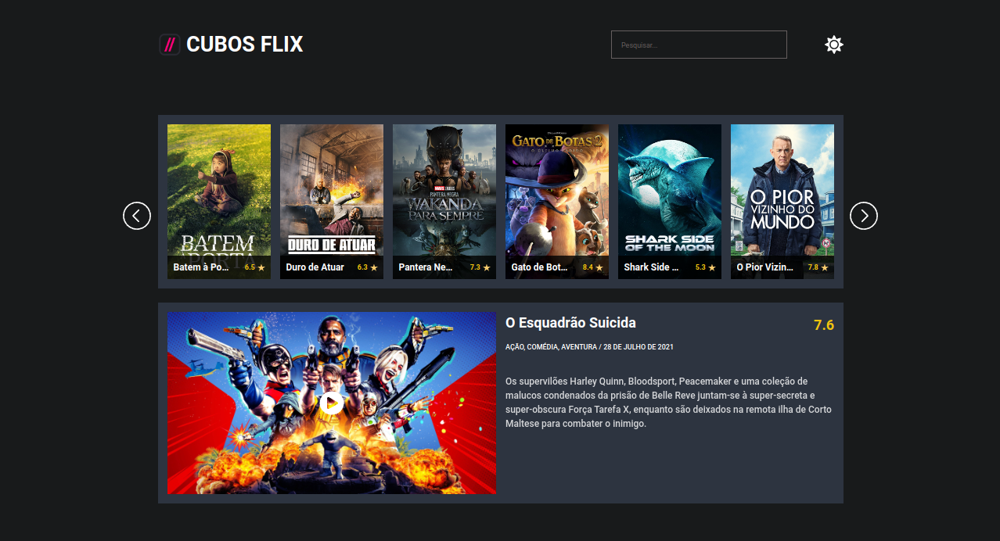
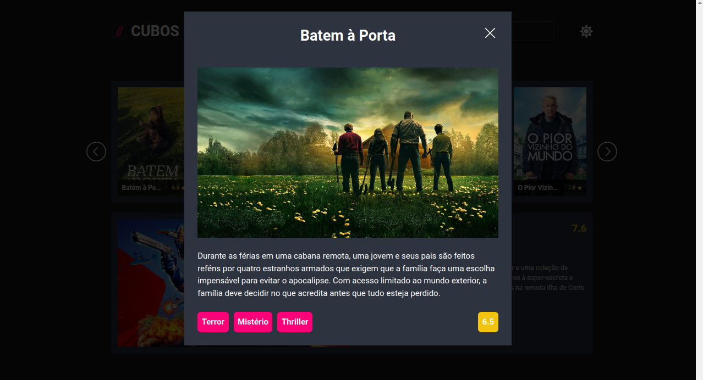
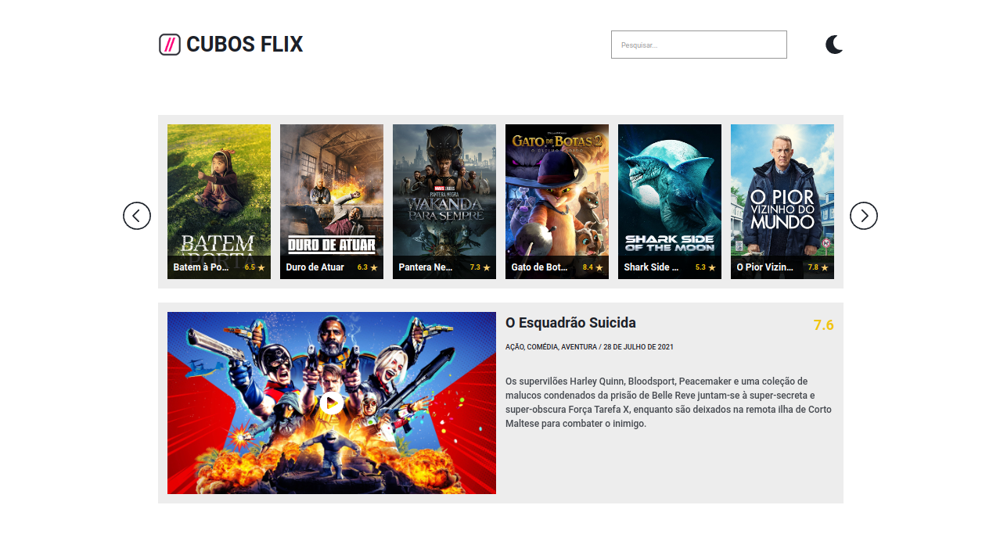
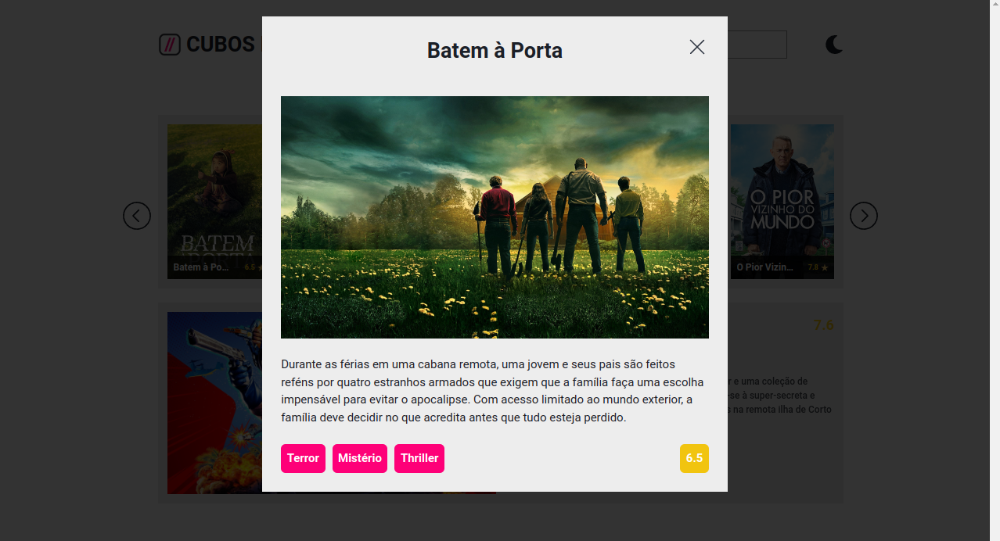

# Cubos Flix

## Desafio | Front-end - Módulo 3 

O desafio consiste em criar uma aplicação para um serviço de streaming (pense num Netflix).

É necessário desenvolver um website com [o seguinte design](https://www.figma.com/file/CLrsT8zY1Tfr53dinLljMu/Desafio-M%C3%B3dulo-2----2.0?node-id=0%3A1) que permita os seguintes itens (funcionalidades com \* ao lado são obrigatórias), utilizando apenas o HTML e CSS dados, criando funcionalidades e interagindo com a API apenas com JavaScript:

- Visualização de filmes (\*)
- Paginação de filmes (\*)
- Busca de filmes (\*)
- "Filme do dia" (\*)
- Modal de filme (\*)
- Mudança de tema

Os dados do website serão requisitados da [seguinte API](https://tmdb-proxy.cubos-academy.workers.dev)

## Requisitos para a execução do projeto

O projeto foi desenvolvido utilizando tecnologias simples contidas no seu navegador, portanto não é necessário instalar nada para executá-lo. Basta abrir o arquivo `index.html` no seu navegador. Caso queira executar o projeto em um servidor local, você pode utilizar o [Live Server](https://marketplace.visualstudio.com/items?itemName=ritwickdey.LiveServer) do Visual Studio Code.

## Preview do projeto

### Dark Mode

### Light Mode

###### tags: `front-end` `HTML` `DOM` `CSS` `desafio`
